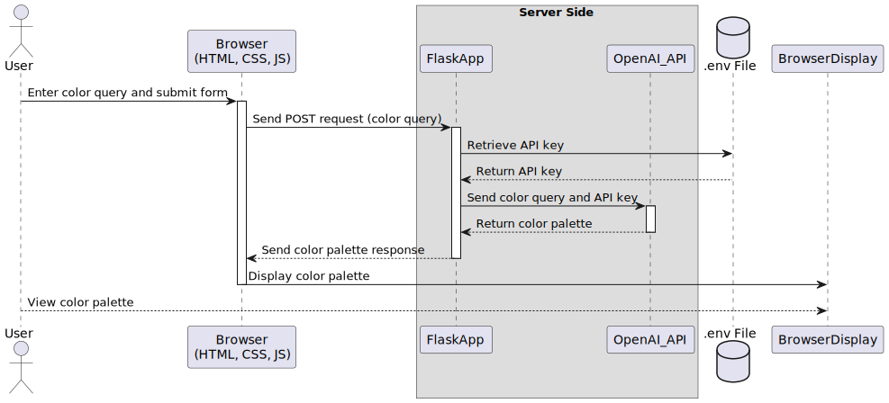

# Flask Application Explanation

## Python

This is a Flask application that utilizes OpenAI's API to generate a color palette based on a user-provided prompt.

`import openai`: This line imports the OpenAI library which is used to interact with OpenAI's API.

`from dotenv import dotenv_values`: This line imports the dotenv_values function from the dotenv package, which is a Python module that reads key-value pairs from a .env file and can inject them into the environment.

`from flask import Flask, render_template, request`: This line imports the Flask class, render_template function, and request object from the Flask library. Flask is a web framework for Python.

`import json`: This line imports the json module which provides functions for working with JSON data.

`config = dotenv_values(".env")`: This line reads the .env file in the current directory and stores the resulting key-value pairs in the config dictionary.

`openai.api_key = config['OPENAI_API_KEY']`: This line retrieves the OpenAI API key from the config dictionary and assigns it to openai.api_key.

`app = Flask(...)`: This line creates a new instance of the Flask application. The parameters set the directories for the templates and static files.

`def get_colors(msg)`: ...: This function generates a color palette based on the provided msg prompt. It creates a prompt string for the OpenAI API, sends a completion request to the API, and then parses the response to extract the generated color palette.

`@app.route("/palette", methods=["POST"])`: This line creates a new route in the Flask application at the /palette URL that listens for HTTP POST requests.

`def prompt_palette()`: ...: This function is associated with the /palette route. It retrieves the query parameter from the incoming POST request, passes it to the get_colors function to generate a color palette, and then returns that palette in the HTTP response.

`@app.route("/")`: This line creates a new route in the Flask application at the root URL ("/").

`def index()`: ...: This function is associated with the root route. It renders and returns an HTML template named index.html.

`if __name__ == "__main__"`: `app.run(debug=True)`: This line starts the Flask development server if the script is being run directly (as opposed to being imported as a module). The debug=True argument enables debug mode, which provides more detailed error messages and enables live reloading of the server when code changes are detected.

Overall, this Flask application provides a web interface for generating color palettes based on user-provided prompts. The user would input a text description into a form on the index.html page, that description would be sent as a POST request to the /palette URL, and then the server would return a generated color palette.

## JavaScript

This JavaScript code is being used in a webpage to interact with a back-end server to fetch color palettes based on a user's input, and then display those colors on the webpage.

Let's break it down:

The form constant holds a reference to the HTML form element with the id of 'form'. It uses the querySelector function to find this element.

An event listener is added to the form which listens for the 'submit' event. When this event occurs, it runs an anonymous function that prevents the form from submitting (which would normally refresh the page) and then calls the getColors function.

The createColorBoxes function is used to create a visual representation of the color palette returned from the server. It accepts an array of colors and a parent element as arguments. It first clears the parent element's innerHTML, then for each color in the array, it creates a new div element, sets its background color to the respective color, and sets its width to a fraction of the parent element's width (the fraction being determined by the number of colors). It also adds an event listener to each div that, when clicked, copies the color to the user's clipboard. Finally, it creates a span element, sets its innerText to the color, and appends the span and div to the parent element.

The getColors function is responsible for making a POST request to the "/palette" endpoint of your back-end server. It retrieves the user's input from the form, sends it as part of the request body, and then processes the response. It parses the response as JSON, extracts the 'colors' field from the response data, finds the element with the class name of 'container', and calls the createColorBoxes function with the colors and the container element.

This function uses the Fetch API to make the request, which returns a Promise. This Promise resolves to the Response object representing the response to the request. The then method is used to handle the Promise, with the first then converting the Response object to JSON and the second then handling the resulting JSON data.

In short, this JavaScript code provides the front-end functionality for the color palette generation application, sending the user's color palette requests to the server and displaying the returned color palettes on the webpage.

## HTML

This HTML file is the base of a simple web application called "Color Palette Generator". Let's break down the elements:

`<!doctype html>`: This declaration helps with browser compatibility. It informs the browser that the document type is HTML5.

`<html lang="en">`: This is the root of an HTML document. The lang attribute declares the language of the page to the browser and to assistive technologies like screen readers.

`<head>`: This element contains metadata about the document, including character encoding, viewport settings, the title of the page, and links to CSS stylesheets or other resources.

`<meta charset="UTF-8">`: Specifies the character encoding for the HTML document.
`<meta name="viewport" content="width=device-width, initial-scale=1.0">`: Makes the web page responsive by setting the viewport to scale to the width of the device.
`<meta http-equiv="X-UA-Compatible" content="ie=edge">`: Ensures the browser will render the page in the highest mode available in various versions of Internet Explorer.
`<title>Color Palette Generator</title>`: Defines the title of the webpage.
`<link rel="stylesheet" href="app.css">`: Links an external CSS file named app.css to the HTML document.
`<body>`: Contains the main content of the HTML document.

`

`: This is an empty container where the JavaScript file will dynamically insert color boxes.
`<form id="form">`: This is the form that takes user input for color queries. It contains:
`<input type="text" name="query">`: This input field is where users will type their queries.
`<button class="btn" type="submit">`Submit</button>: This button will trigger the form submission.
``: At the end of the body tag, this line includes the app.js JavaScript file, which handles form submission and updates the page dynamically with color palettes.
In summary, this HTML file creates the structure for a simple color palette generation application. It's an interface for users to input their queries, and the response will be dynamically added to the .container div by the JavaScript file app.js.

## CSS

This CSS code defines the styling rules for the HTML elements in the webpage of the color palette generator application. Let's break down the main sections:

`html, body`: This rule applies to both the html and body elements. It sets the margin and padding to 0 to remove any default spacing around the edges, and it sets the font to a sans-serif typeface.

`.container`: This rule applies to elements with a class of 'container'. It sets the background color to black (#000), the width to 100% (full width of its parent), and the height to 100vh (full height of the viewport). It also applies a flexbox layout context to the container, meaning its child elements will be laid out along a line and can be distributed evenly.

`.color`: This rule applies to elements with a class of 'color'. It sets their height to 100% (filling the height of the '.container'), and arranges the items in the center of the element both horizontally (with justify-content: center) and vertically (with align-items: end). It also changes the cursor to a pointer when hovering over the element.

`.color:hover`: This rule applies when a user hovers over an element with the 'color' class. It reduces the opacity to 0.8, creating a translucent effect.

`.color span`: This rule applies to span elements within '.color' elements. It sets the text color to white, increases the font size, adds some padding, and gives the text a shadow effect.

`#form`: This rule applies to the element with the id 'form'. It centers the form in the page (using a combination of position: absolute, top: 50%, left: 50%, and transform: translate(-50%, -50%)), gives it a white background, and adds some padding. It also uses flexbox to center its content.

`#form input and .btn`: These rules apply to the input field and the button within the form, respectively. They both give their respective elements some padding, a black border, rounded corners, and remove the default browser outline. The font size is also increased.

`.btn:hover`: This rule applies when a user hovers over an element with the class 'btn'. It changes the background color to black and the text color to white, giving the button a hover effect.

In summary, this CSS file describes how the different elements of the webpage should be displayed and how they should respond to user interaction. It creates a consistent visual style and enhances the user experience with hover effects.

## SVG Diagram

This diagram should give a more accurate depiction of the process flow. The user interacts with the browser, which communicates with the Flask app on the server side. The server retrieves the necessary API key, makes a request to the OpenAI API, and receives a color palette in response. The browser then displays this palette, which the user can view.

